# Automated EC2 Network Security: RMF Continuous Control Enforcement

[](https://aws.amazon.com/config/)
[](https://csrc.nist.gov/projects/risk-management)
[](https://aws.amazon.com/lambda/)

> **Automated enforcement of NIST RMF controls AC-4, CA-7, and SC-7 through continuous monitoring, automated remediation, and compliance validation of AWS Security Group configurations that expose SSH (22) or RDP (3389) to 0.0.0.0/0.**

---

## Overview

This project implements an automated security control system that continuously monitors and remediates critical network vulnerabilities in AWS environments. Specifically, it prevents unauthorized exposure of Remote Desktop Protocol (RDP) port 3389 and Secure Shell (SSH) port 22 to the public internet (0.0.0.0/0).

The system continuously monitors Security Groups for configuration drift related to administrative ports (22 and 3389) open to the public internet. When a violation is detected, AWS Config triggers an automated remediation workflow that restores the resource to a compliant state within minutes.

## 🎥 Video Walkthrough

Watch a 7-minute technical demonstration of this project in action:

[](https://www.youtube.com/watch?v=EHbd3LU4qsA)

*Click to watch: Problem → Architecture → Live Demo → Results*

### The Problem

Publicly accessible administrative ports represent one of the most critical security vulnerabilities in cloud infrastructure. When SSH (port 22) or RDP (port 3389) are exposed to 0.0.0.0/0, you essentially leave the front door to your servers wide open to the entire internet.

**Risk Level Summary:**

| Component | Port | Protocol | Risk Level | Impact |
|-----------|------|----------|------------|--------|
| **SSH** | 22 | TCP | High | Direct command-line access to server |
| **RDP** | 3389 | TCP | Critical | Full graphical desktop access |
| **Source** | 0.0.0.0/0 | N/A | Maximum | Any IP address globally can connect |

---

## Attack Vectors

### 1. Brute-Force Attacks

Automated bots continuously scan the internet for exposed ports 22 and 3389. With world-open access, attackers can launch sustained credential-guessing campaigns:

- **SSH**: Bots attempt common usernames (`admin`, `ubuntu`, `ec2-user`) and passwords to gain command-line access
- **RDP**: Attackers target credentials for full interactive desktop sessions, often resulting in immediate system compromise

### 2. Zero-Day and Unpatched Vulnerabilities

Public exposure amplifies the impact of service vulnerabilities:

**Real-World Example**: The 2019 BlueKeep vulnerability (CVE-2019-0708) allowed attackers to achieve remote code execution via RDP without authentication. Publicly exposed port 3389 instances were the primary attack vector for mass exploitation.

### 3. Reconnaissance and Footprinting

Open administrative ports leak valuable intelligence even on fully patched systems, enabling attackers to:
- Identify operating system types and versions
- Build detailed infrastructure profiles
- Plan targeted attacks with precision

---

## Solution Architecture

This automation implements a structured control flow that aligns with NIST RMF:
Drift Detection → Automated Remediation → Audit & Continuous Monitoring

Monitored Condition: Inbound rules allowing SSH (22) or RDP (3389) from 0.0.0.0/0.

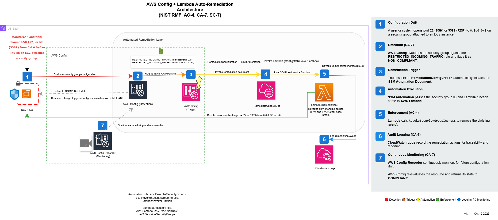

Figure: Automated remediation workflow showing AWS Config detection, Lambda enforcement, and CloudWatch logging.

### Component Breakdown

#### 1. Detection Layer (CA-7 – Continuous Monitoring)
- **AWS Config** evaluates Security Groups with the managed rule **RESTRICTED_INCOMING_TRAFFIC** (ports **22** and **3389**).
- Non-compliant changes are flagged; a **RemediationConfiguration** is associated to each rule.

#### 2. Enforcement Layer (AC-4, SC-7 – Access Control & Boundary Protection)
- **SSM Automation Document** orchestrates remediation.
- **AWS Lambda** revokes only the offending ingress entries (IPv4 and IPv6), preserving legitimate rules.

#### 3. Audit Layer (CA-7 – Assessment & Authorization)
- **CloudWatch Logs** record Lambda execution and outcomes.
- **SSM Automation** retains workflow history.
- **AWS Config Recorder** re-evaluates the resource and updates status to **COMPLIANT**.
- **CloudTrail** is the system of record for API activity across EC2, Config, Lambda, and SSM.
---

## NIST RMF Control Mapping

| Control | Name | Implementation |
|---------|------|----------------|
| **AC-4** | Information Flow Enforcement | Lambda function enforces network access restrictions by revoking unauthorized ingress rules |
| **CA-7** | Continuous Monitoring | AWS Config provides near real-time detection; CloudWatch/SSM create comprehensive audit trail |
| **SC-7** | Boundary Protection | Automated enforcement ensures principle of least privilege at network perimeter |
| **AU-12** | Audit Generation | CloudTrail records API activity for EC2, Config, Lambda, and SSM. CloudWatch Logs stores Lambda execution logs. SSM keeps Automation run history. |
| **AU-2** | Auditable Events | Events exist for opening and revoking 22 or 3389, compliance state changes, Automation invocations, and Lambda execution. |
| **AU-3** | Content of Audit Records | CloudTrail entries include principal, time, request, response, and event ID. Lambda logs include timestamps and status. |
| **AU-8** | Time Stamps | CloudTrail and CloudWatch Logs use consistent UTC timestamps. |

**Audit hardening (optional):** enable CloudTrail integrity validation, encrypt the trail bucket with SSE-KMS, set log retention, and add delivery/remediation alarms.

> Assumption: An account or organization CloudTrail trail is enabled and delivering to S3.

---

## Monitored Rule Definition
This automation targets Security Group ingress rules that:
- Allow **SSH (22)** or **RDP (3389)**
- Have a source of **0.0.0.0/0**
- Are attached to **EC2 instances** in scope

Violations trigger AWS Config **RemediationConfiguration** → **SSM Automation** → **Lambda**.

---

## Deployment

### Prerequisites
- AWS CLI configured with appropriate credentials
- IAM permissions for CloudFormation, Config, Lambda, SSM, and EC2

### Quick Start

# Clone the repository
```
git clone https://github.com/Nisha318/config-auto-revoke-sg.git
cd config-auto-revoke-sg
aws cloudformation deploy \
  --template-file cloudformation/remediation-stack.yaml \
  --stack-name RMF-Auto-SG-Remediation \
  --capabilities CAPABILITY_NAMED_IAM
```

# After deployment, AWS Config begins evaluating Security Groups.
# Any violation matching the monitored rule will auto-remediate.

> Test in a **non-production account**. Opening 22/3389 to 0.0.0.0/0, even briefly, can expose instances to scanning.


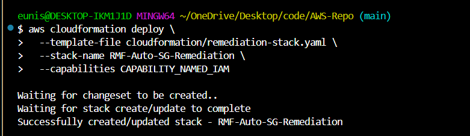
---

## Validation Walkthrough: From Violation to Compliance

### Initial State: Compliant Environment

**CloudFormation Stack Deployed:**
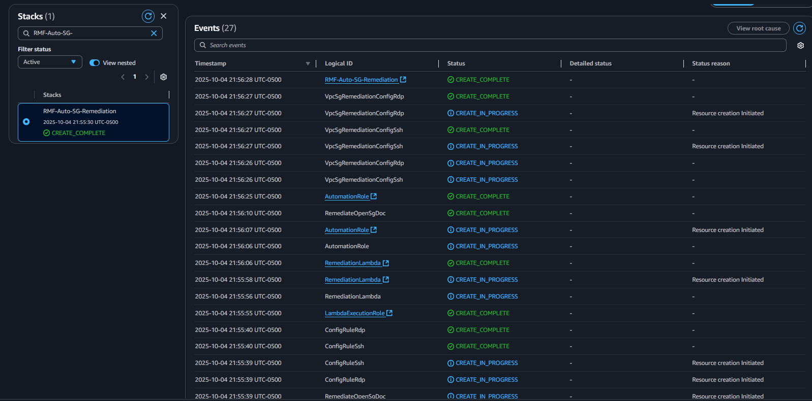

**AWS Config Dashboard (All Compliant):**
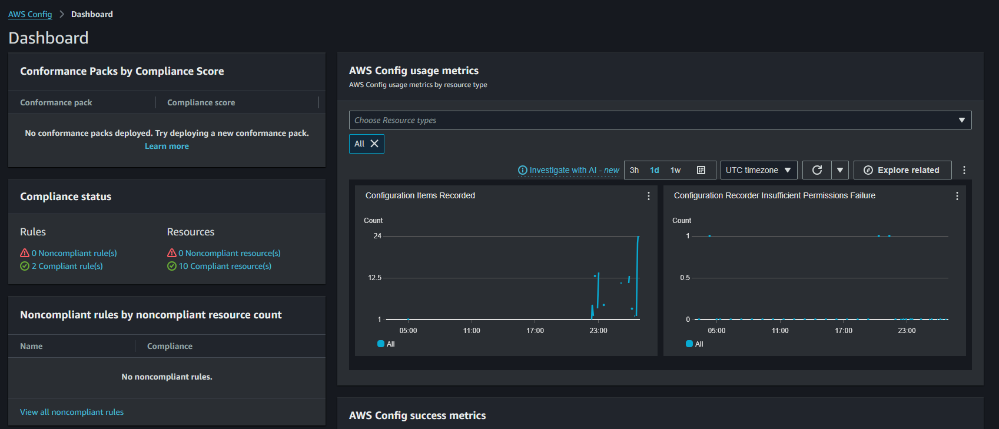

**Initial Security Group States (No Inbound Rules):**

*RDP Security Group:*
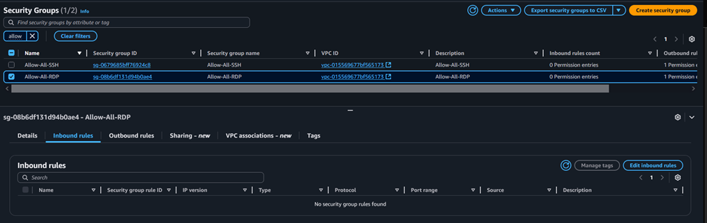

*SSH Security Group:*
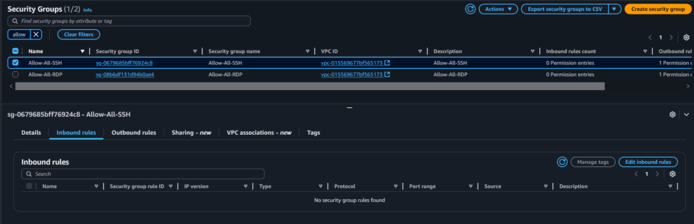

---

### Phase 1: Violation Detection

**Simulated Attack: Opening Ports to 0.0.0.0/0**

*RDP Port Exposed:*
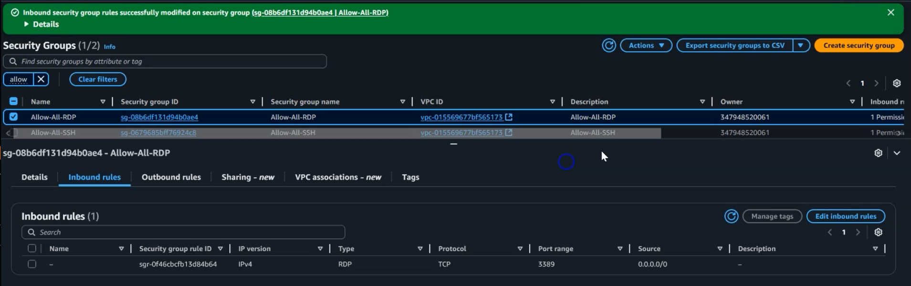

*SSH Port Exposed:*
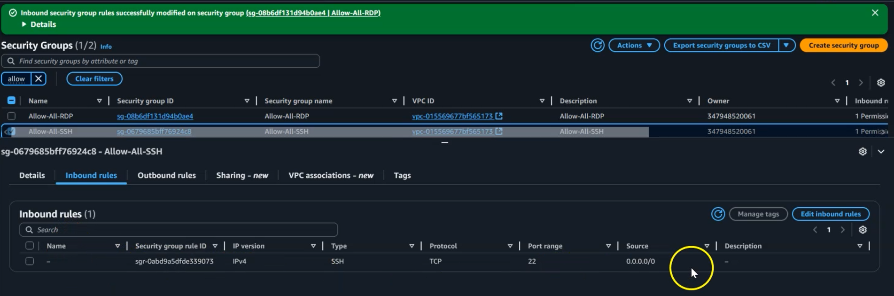

**Config Rules Triggered (Non-Compliant Status):**
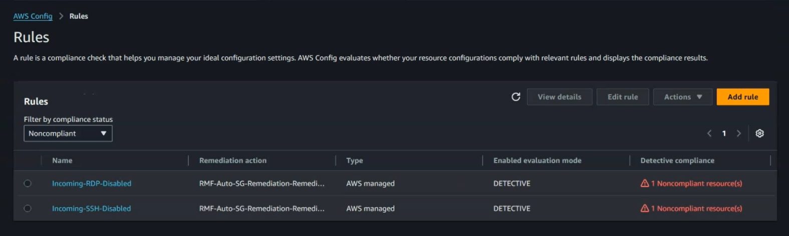

**Non-Compliant Resource Inventory:**
- `sg-0679685bff76924c8` (SSH Security Group)
- `sg-08b6df131d94b0ae4` (RDP Security Group)

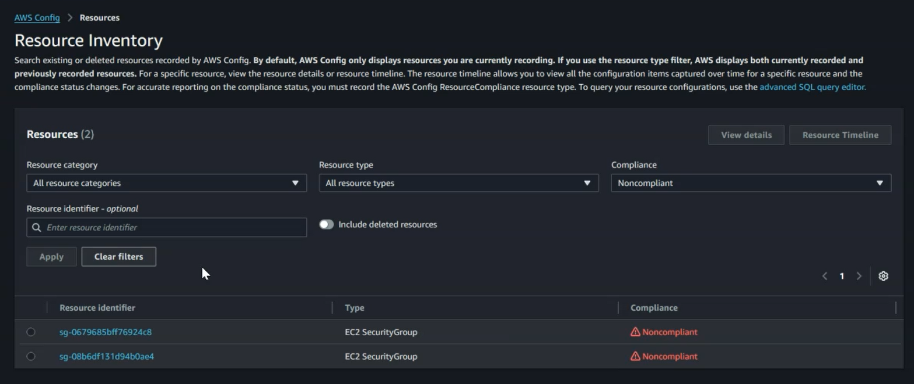

---

### Phase 2: Automated Enforcement

**Lambda Execution Logs (CloudWatch):**

*SSH Rule Revocation:*
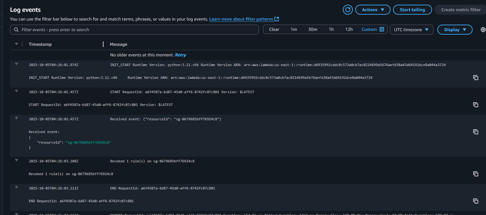

*RDP Rule Revocation:*
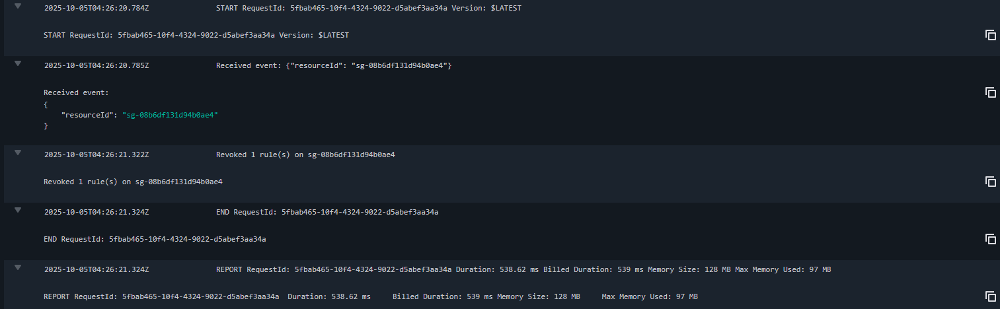

**Lambda Invocation Details:**
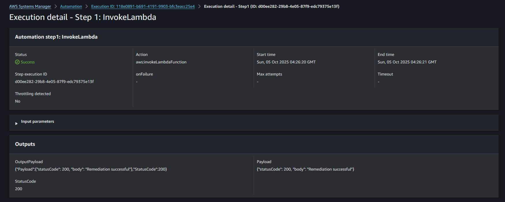
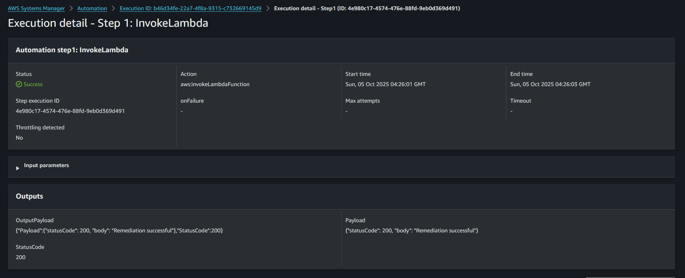

---

### Phase 3: Verified Remediation

**Final Security Group State (Rules Revoked):**
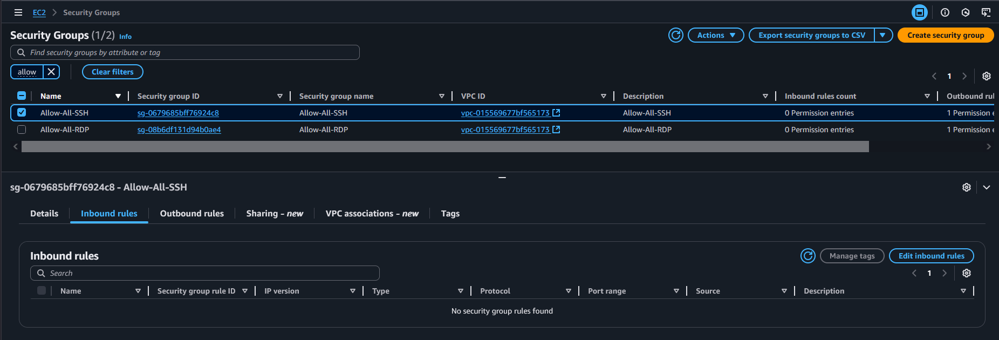

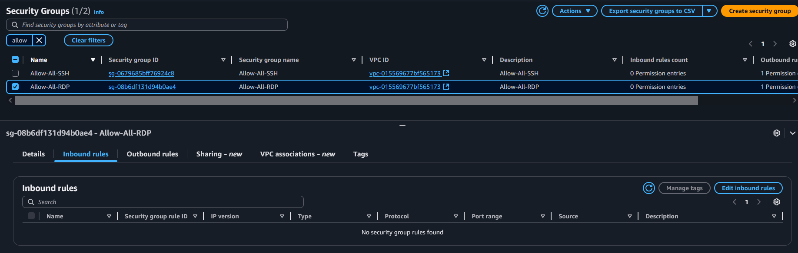

✅ **Result**: Unauthorized ingress rules automatically removed, security posture restored

---

## Technical Implementation

### Core Components

config-auto-revoke-sg/
├─ cloudformation/remediation-stack.yaml
├─ src/lambda/revoke_sg/app.py # or lambda/revoke_rules_handler.py
├─ assets/images/architecture.png
└─ assets/images/... # walkthrough screenshots

#### CloudFormation Template
Complete infrastructure as code defining Config rules, Lambda function, SSM automation, and IAM roles.

📄 **[View: cloudformation/remediation-stack.yaml](https://github.com/Nisha318/config-auto-revoke-sg/blob/main/cloudformation/remediation-stack.yaml)**

#### Lambda Remediation Handler
Python function that identifies and revokes non-compliant security group rules using EC2 API.

📄 **[View: config-auto-revoke-sg/revoke_rules_handler.py](https://github.com/Nisha318/config-auto-revoke-sg/blob/main/lambda/revoke_rules_handler.py)**

### Key Lambda Logic

```python
# Core remediation logic
response = ec2.revoke_security_group_ingress(
    GroupId=sg_id,
    IpPermissions=[rule]
)

print(f"Revoked {len(ip_permissions)} rule(s) on {sg_id}")
print(f"Response: {response['ResponseMetadata']['HTTPStatusCode']}")
```

---

## Security Best Practices

### Recommended Access Controls

Instead of 0.0.0.0/0, restrict SSH and RDP access to:

1. **Corporate IP Ranges**: Specific CIDR blocks (e.g., `203.0.113.0/24`)
2. **Bastion Hosts**: Dedicated jump servers with hardened configurations
3. **VPN Endpoints**: IPsec or OpenVPN termination points
4. **AWS Systems Manager Session Manager**: Eliminates need for direct SSH/RDP entirely

### Principle of Least Privilege

This automation enforces the fundamental security principle:
> **Grant only the minimum network access required for legitimate business operations**

---

## Monitoring and Maintenance

### CloudWatch Metrics
- Lambda execution success/failure rates
- Config rule evaluation frequency
- SSM automation execution duration

### Alerts and Notifications
Consider adding SNS topics for:
- Non-compliance detections
- Remediation execution failures
- Repeated violation patterns (indicating potential attacks)


## 🎥 Video Walkthrough

Watch a 7-minute technical demonstration of this project in action:

[](https://www.youtube.com/watch?v=EHbd3LU4qsA)

*Click to watch: Problem → Architecture → Live Demo → Results*
---

## Contributing

Contributions are welcome! Please submit pull requests or open issues for:
- Additional security controls
- Enhanced logging capabilities
- Performance optimizations
- Documentation improvements

---
## License

MIT License

Copyright (c) 2025 Nisha318

Permission is hereby granted, free of charge, to any person obtaining a copy
of this software and associated documentation files (the "Software"), to deal
in the Software without restriction, including without limitation the rights
to use, copy, modify, merge, publish, distribute, sublicense, and/or sell
copies of the Software, and to permit persons to whom the Software is
furnished to do so, subject to the following conditions:

The above copyright notice and this permission notice shall be included in all
copies or substantial portions of the Software.

THE SOFTWARE IS PROVIDED "AS IS", WITHOUT WARRANTY OF ANY KIND, EXPRESS OR
IMPLIED, INCLUDING BUT NOT LIMITED TO THE WARRANTIES OF MERCHANTABILITY,
FITNESS FOR A PARTICULAR PURPOSE AND NONINFRINGEMENT. IN NO EVENT SHALL THE
AUTHORS OR COPYRIGHT HOLDERS BE LIABLE FOR ANY CLAIM, DAMAGES OR OTHER
LIABILITY, WHETHER IN AN ACTION OF CONTRACT, TORT OR OTHERWISE, ARISING FROM,
OUT OF OR IN CONNECTION WITH THE SOFTWARE OR THE USE OR OTHER DEALINGS IN THE
SOFTWARE.

---

## Acknowledgments

Built on AWS native services following NIST Risk Management Framework (RMF) guidelines and security best practices.

---

## Contact

**Project Maintainer**: Nisha P McDonnell 
**Repository**: https://github.com/Nisha318/

---

## Additional Resources

- [NIST RMF Documentation](https://csrc.nist.gov/projects/risk-management)
- [AWS Config Best Practices](https://docs.aws.amazon.com/config/latest/developerguide/best-practices.html)
- [EC2 Security Group Guidelines](https://docs.aws.amazon.com/AWSEC2/latest/UserGuide/security-group-rules.html)
- [AWS Systems Manager Session Manager](https://docs.aws.amazon.com/systems-manager/latest/userguide/session-manager.html)
